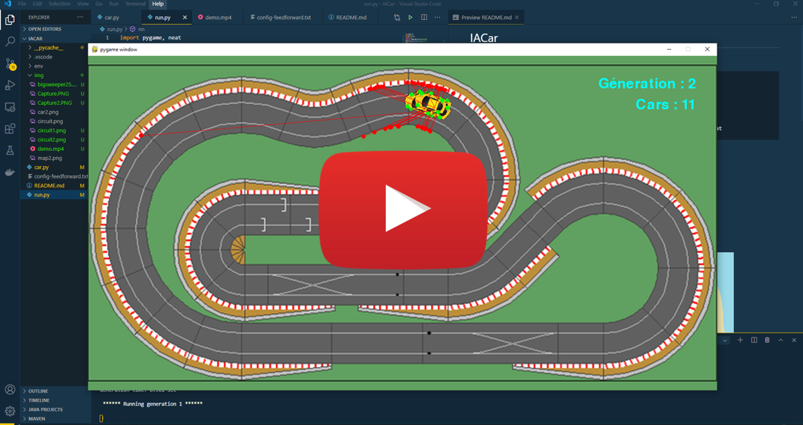
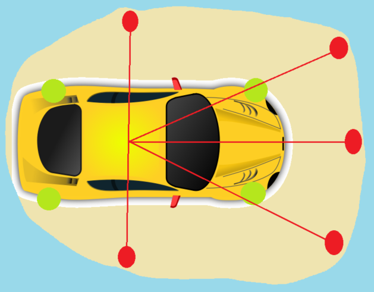
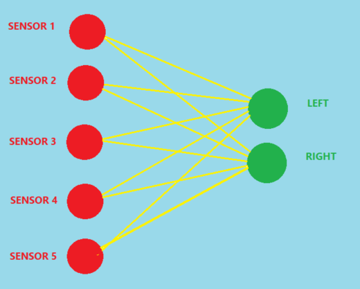

# AICar

## Descripiton :

Autonomus car project using Pygame and Neat.\
I wanted to realize this project after seeing a video on youtube : https://www.youtube.com/watch?v=r428O_CMcpI, code Bullet video.\
Documentation for Neat : https://neat-python.readthedocs.io/en/latest/ \
Documentation for Pygame : https://www.pygame.org/docs/ \
Help source : https://github.com/monokim/framework_tutorial/tree/master/neat \
source and credits for cicuit image : https://scalextricdigital.weebly.com/8x4-layouts.html \
source and credits fro the car image : https://freesvg.org/yellow-car-top-view-remix
## Demo:

## The Car :

*   4 collisions points (green)
*   5 sensors (red)

Our Neural Networks is fed with data from sensors, the distance between the car and a wall.

## The Neural Network :

*   Activation function : tanh
*   Population size = 30
*   nb_max generation = 50

## Futur ?
*   Manage the speed and angle of the car when its running
*   Draw is own circuit before the race
