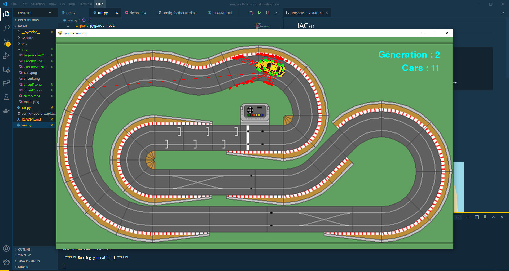

# IACar

## Descripiton :
    Autonomus car project using Pygame and Neat.
    I wanted to realize this project after seeing a video on youtube : https://www.youtube.com/watch?v=r428O_CMcpI, code Bullet video.\
    Documentation for Neat : https://neat-python.readthedocs.io/en/latest/ 
    Documentation for Pygame : https://www.pygame.org/docs/ 
    Help source : https://github.com/monokim/framework_tutorial/tree/master/neat
    

## Demo :

## The Car :

*   4 collisions points (green)
*   5 sensors (red)

Our Neural Networks is fed with data from sensors, the distance between the car and a wall.

## The Neural Network :

## Futur ?
